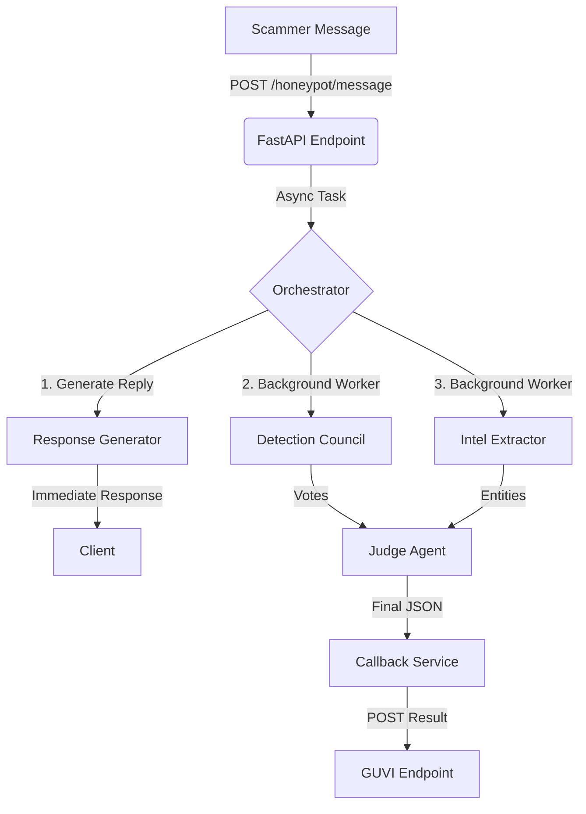

# 🔄 Agentic Honeypot Workflow

This document details the end-to-end workflow of the **Agentic Honeypot**, from receiving a scam message to reporting actionable intelligence.

## 1. High-Level Flow

The system operates on a **Split-Process Architecture**:
1.  **Synchronous Path (Fast)**: Immediate engagement with the scammer (Latency < 2s).
2.  **Asynchronous Path (Deep)**: In-depth analysis, council voting, intelligence extraction, and reporting.



---

## 2. Request Lifecycle (Step-by-Step)

### Step 1: Incoming Request
The API receives a `POST` request at `/honeypot/message`.
- **Validation**: Checks for valid `x-api-key` and payload structure.
- **Sanitization**: Timestamps are removed internally to keep LLM prompts clean.

### Step 2: Session Management
- If a session ID exists, the system retrieves the conversation history.
- **Concurrency Control**: If a background worker is *already* analyzing a previous message for this session, it is **aborted** to prevent race conditions and save resources.

### Step 3: Immediate Engagement (Sync)
- **Persona**: The system assumes the persona of "Ramesh Kumar" (or similar confused victim).
- **Model**: Uses a high-speed Groq model (e.g., Llama 3.3).
- **Response**: Returns a human-like reply immediately to keep the scammer hooked.
- **Latency**: Typically < 1.5 seconds.

### Step 4: Background Assignment
Once the reply is sent, the `Orchestrator` assigns the deep analysis task to a **Worker Pool** (default: 4 workers).
- **Fire-and-Forget**: The HTTP response to the scammer is already finished. The server continues working in the background.

---

## 3. The "Brain": Asynchronous Analysis

### A. The Wait (Council Delay)
If this is the **first message** in a session:
- The worker waits for **3 seconds** before starting analysis.
- **Why?** To allow the scammer to send follow-up messages (e.g., "Hello?" ... "Are you there?").
- If a new message arrives during this wait, the current task is cancelled, and the new message triggers a fresh analysis (refer to Step 2).

### B. Detection Council (Parallel Voting)
The **Detection Council** is a group of specialized AI agents that vote on whether the message is a scam. usage `asyncio.gather` for true parallelism.

| Agent | Responsibility |
| :--- | :--- |
| **NemotronVoter** (NVIDIA) | Checks for harmful/fraudulent intent. |
| **GptOssVoter** (Groq) | Analyzes the "playbook" (e.g., is this a known job scam?). |
| **LlamaScoutVoter** (Groq) | Looks for bot-like patterns and anomalies. |
| **MinimaxVoter** (NVIDIA) | Analyzes linguistic urgency and tone. |
| **QwenVoter** (Groq) | Performs deep logical reasoning. |
| **GroqCompoundVoter** | Aggregates multiple perspectives. |

### C. Intelligence Extraction
Parallel to voting, the **Intelligence Extractor** runs:
1.  **Regex Scanning**: Instantly finds phone numbers, URLs, UPI IDs, and bank account numbers using strict patterns.
2.  **LLM Extraction**: A specialized model parses the text for subtler entities (e.g., "Send money to my brother's account...").

### D. The Judge (Aggregation)
The **Judge Agent** (Llama 3.3 70B) receives:
- All 6 Council Votes.
- Extracted Intelligence.
- Conversation History.

**The Judge's Job:**
1.  **Verdict**: Decides if it is truly a scam (requires >50% council consensus).
2.  **Confidence**: Calculates a final confidence score.
3.  **JSON Construction**: Builds the strict JSON payload required by the callback endpoint.

---

## 4. Reporting (Callback)

The **Callback Service** sends the final intelligence report to the configured GUVI endpoint.

### Triggers
1.  **Scam Confirmed**: High-confidence verdict.
2.  **Inactivity**: If the scammer stops replying (default 20s).

### Payload Structure
```json
{
  "sessionId": "unique-session-id",
  "scamDetected": true,
  "totalMessagesExchanged": 5,
  "extractedIntelligence": {
    "bankAccounts": ["1234567890"],
    "upiIds": ["scammer@ybl"],
    "phishingLinks": ["http://bit.ly/fake"],
    "phoneNumbers": ["9876543210"],
    "suspiciousKeywords": ["blocked", "urgent", "kyc"]
  },
  "agentNotes": "Detected banking fraud pattern. User attempted to solicit KYC details."
}
```

### 5. Key Configuration Parameters

All tunable parameters are in `.env`:

| Parameter | Default | Description |
| :--- | :--- | :--- |
| `WORKERS` | `4` | Number of concurrent background analysis tasks. |
| `COUNCIL_DELAY_SECONDS` | `3.0` | Wait time for first message aggregation. |
| `INACTIVITY_TIMEOUT_SECONDS` | `20` | Session timeout for inactivity. |

